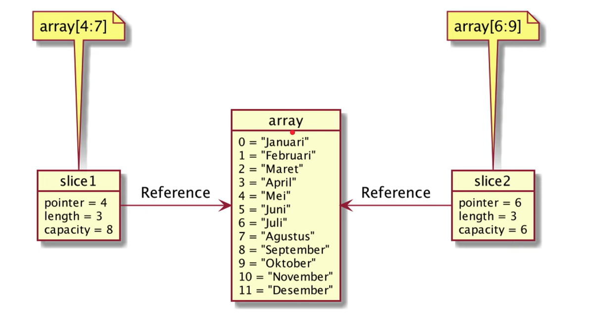

---- Belajar bahasa GOLANG ----

**Tipe data Number**

- Integer: bilangan bulat, ada int 8 min number -128 => 127, int16 dll.
- Floating Point: bilangan desimal. 1,18 * 10^-38

**Alias**
byte === uint8
rune === int32
int === min int32
uint === min uint32

**Tipe data Boolean**
pada golang menggunakan kata kunci **bool**
sama seperti bahasa lain yaitu true dan false.

**Tipe data String**
pada golang jika menggunakan tipe data string menggunakan petik dua ("").
contoh => "Heloo world"
function untuk string:
- len("string") = menghitung jumlah karakter
- "string"[string] = mengambil karakter pada lokasi yg ditentukan, dan akan mengembalikan dalam bentuk byte.

**Variable**
- variable adalah tempat untuk menyimpan data
- di Go-Lang tidak harus mendefinisikan tipe data juga bisa.
- di golang juga tidak harus menggunakan var. akan tetapi hanya pada awalan saja
- Multiple Variable: var (fisrtName = "Daril" middleName = "Insan" lastName = "Kamil")
- jika variable tidak digunakan akan menyebabkan error.

**Constant**
-variable yang tidak bisa diubah
- menggunakan const, misalnya const name = "Daril"
- jika tidak digunakan tidak masalah.

**Konversi Tipe data**
- jika nilainya lebih besar dari int(16,32,64) akan menjadi "minus" -, karena adanya overflow nilai misal 

**Type declarations**
- mmebuat ulang tipe data
- kaya type  di bahasa typescriptlah

**Operasi Matematika**
+: penjumlahan
-: pengurangan
*: perkalian
/: pembagian
%: habis bagi sisa

**Augmented Assignment**
- operasi matematika terhadap varible itu sendiri
- a+=10, a-=10

**unary Operator**
- menambahkan hanya satu, misal a++, a--

**Operasi Perbandingan**
- membandingakn 2 buah data
- akan mengembalikan nilai boolean benar atau salah (true / false)
operator perbandingan: 
> : lebih dari (untuk tipe data number)
< : kurang dari (untuk tipe data number)
>= : lebih dari sama dengan (untuk tipe data number)
<= : kurang dari sma dengan (untuk tipe data number)
== : sama dengan (untuk tipe data number, string)
!== : tidak sama dengan (untuk tipe data number, string)

**Operasi Boolean**
&& AND : jika data 1 dan data 2 true maka hasilnya true, dan jika salah satu data false maka hasilnya false. jika keduanya false maka false.
|| OR : jika data 1 dan data 2 true maka hasilnya true, dan jika salah satu data true maka hasilnya true. jika keduanya false maka false.
! Kebalikan : !data1 (true) maka hasilnya false dan sebaliknya.

**Tipe data Array**
- berisi kumpulan data dengan tipe data yang sama.
- pada golang kita harus menentukan jumlah data yang dapat ditampung array. jika sudah ditetapkan kita tidak bisa menambahkan data dalam array.
- array mempunyai index. dimulai dari angka 0
- jika tidak mau menentukan jumlahnya secara pasti gunakan [...]. dan hanya berfungsi ketika datanya disi secara langsung.

**function array**
len(array) : mendapatkan panjang array
array[index] : mendapatkan data di posisi index
array[index] = value : mengubah data berdasarkan posisi indexnya

**Tipe data slice**
- potongan dari data array
- ukurannya bisa berubah, karena bisa ditambah dan dihapus datanya
- Slice memiliki 3 data, yaitu pointer, length, dan capacity {
    pointer: penunjuk data pertama di array para slice
    length: panjang dari slice
    capacity: kapasitas slice, dimana length tdk boleh lebih dari capacity
}
- membuat slice dari array: {
    arr[low:high]: membuat slice dari array dimulai dari index low ke high
    arr[low:]: membuat slice dari array dimulai dari index low hingga index terakhir
    arr[:high]: membuat slice dari array dimulai dari index high sampai index sebelum high
    arr[:]: membuat slice dari array dimulai index 0 sampai index akhir di array
}

misal arr[4:7] = {
    angka 4 menunjukan pointer(penunjuk data pertama)
    angka 7 menunjukan capacity(jumlah data yang bisa ditampung dalam arr)
    lengthnya 3 karena selisih dari pointer dan capacity adalah 3
}

**function Slice**
- len(): mendapatkan panjang slice. misal arr[4:6] berarti 2
- cap(): mendapatkan kapasitas menghitungnya dari pointernya
- append{slice, data}: membuat slice baru dengan menambah data ke posisi terakhir, jika kapasitas sudah penuh maka akan membuat array baru
- make([]TypeData, length, capacity): membuat slice baru
- copy(destination, source): menyalin slice dari source ke destinantion

**tipe data map**
- map adalah kumpulan data yang sama, namun kita bisa menentukan jenis tipe data index yang akan kita gunakan
- Map adalah kumbulan data key-value, kata kunci harus unik
- index di dalam map disebut key, 

**function map**
- len(): untuk mendapatkan jumlah data di map
- map[key]: mengambil data di map dengan key
- map[key]=value :mengubah data di map dengan key
- make(map[typedata]Typevalue): membuat map baru
- delete(map, key): menghapus data di map dengan key

**percabangan**
- if
- else: jika block if kondsinya false maka kode di else akan dieksekusi
- else if: jika kita butuh bebrapa kondisi
- switch

**perulangan**
- for loops
- for range
break: untuk menghentikan perulangan
continue: untuk mengentikan perulangan dan melanjutkan ke perulangan selanjutnya.

**function**
- kode blok yang dibuat untuk dipakai berulang-ulang
- didalam golang function bisa menjadi sebuah variable
- function as parameter
- anonymous function
- recrusive function